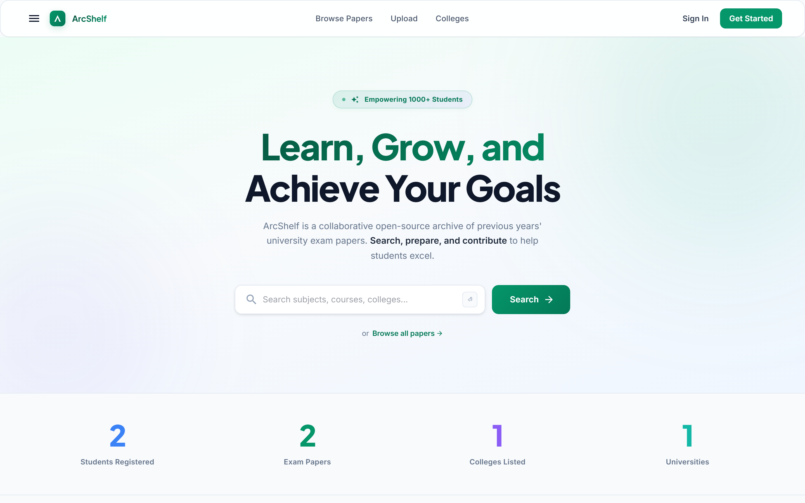
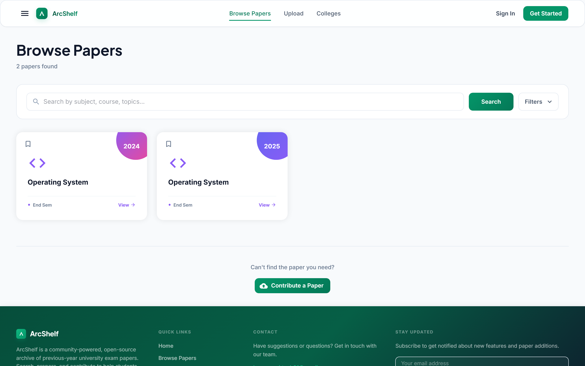
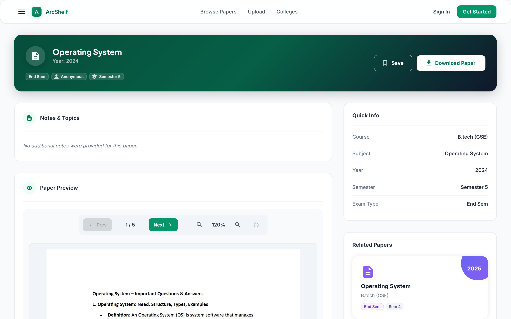
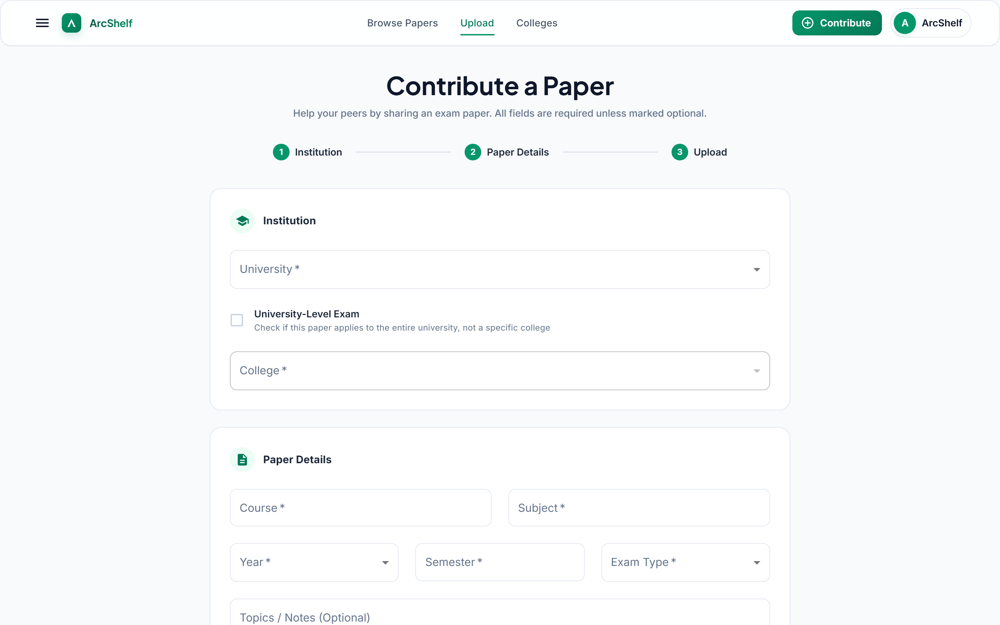
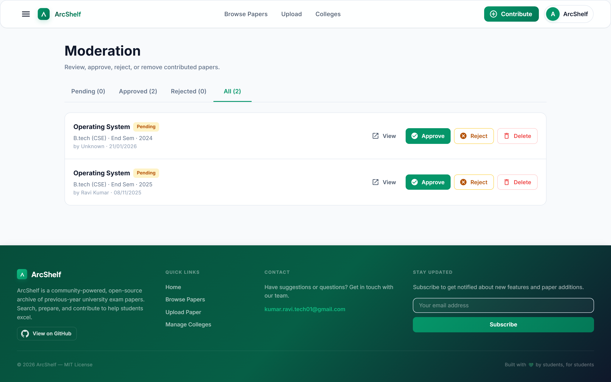
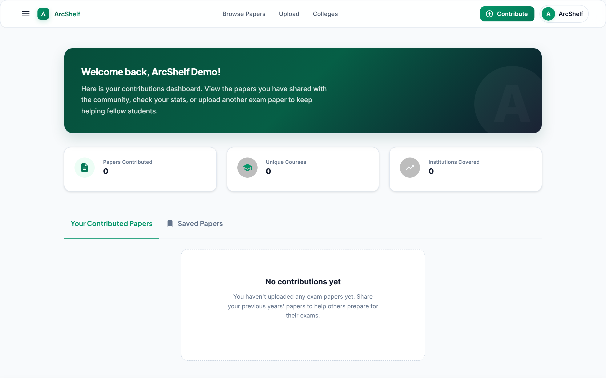

<div align="center">

# ArcShelf

**An open-source, community-powered archive of previous years' exam papers — built by students, for students.**

Find, prepare, and contribute exam papers from universities and colleges, so students everywhere can prepare, perform, and grow in their exams.

[](https://github.com/ravii333/Arcshelf)
[](https://github.com/ravii333/Arcshelf/blob/main/LICENSE)
[](https://github.com/ravii333/Arcshelf/stargazers)

</div>

---

## Features

- **Browse by Hierarchy** — Navigate papers through a University → College → Course structure
- **Search** — Quickly find papers by subject, course, or keyword
- **Community Contributions** — Submit exam papers (PDFs/Images) via a streamlined upload form
- **PDF Viewer** — View papers directly in the browser with a built-in PDF reader
- **User Authentication** — Register/login with JWT-based auth; protected submission routes
- **Cloud Storage** — All files stored and delivered via Cloudinary
- **University & College Management** — Admin pages to add and organize institutions
- **Moderation & Approval** — Admin dashboard to review, approve, or reject submitted papers (with rejection notes)
- **Save Papers** — Bookmark/wishlist papers to revisit later
- **Responsive UI** — Clean, minimalist design with Tailwind CSS and Material-UI

---

## Screenshots

> Drop images into `docs/screenshots/` with the filenames below and they'll render here.

| Home | Browse Papers |
|---|---|
|  |  |

| Paper Detail (PDF Viewer) | Submit a Paper |
|---|---|
|  |  |

| Admin Moderation | Dashboard |
|---|---|
|  |  |

---

## Tech Stack

| Layer | Technology |
|---|---|
| Frontend | React 19 + Vite |
| Routing | React Router DOM 7 |
| UI | Material-UI (MUI) + Tailwind CSS |
| Backend | Node.js + Express 5 |
| Database | MongoDB + Mongoose |
| Auth | JWT (jsonwebtoken + bcryptjs) |
| File Storage | Cloudinary + Multer |
| HTTP Client | Axios |

---

## Project Structure

```
arcshelf/
├── client/                         # React frontend
│   ├── src/
│   │   ├── api/
│   │   │   └── index.js            # Axios client + all API calls
│   │   ├── components/
│   │   │   ├── common/             # Card, ContributionCard, FeatureCard, PDFViewer, Icons
│   │   │   ├── forms/              # Input, Select, Textarea, FileUpload
│   │   │   ├── Footer.jsx
│   │   │   ├── Layout.jsx
│   │   │   ├── Navbar.jsx
│   │   │   └── Sidebar.jsx
│   │   ├── context/
│   │   │   └── AuthContext.jsx     # Auth context provider
│   │   ├── hooks/
│   │   │   └── useFetch.js         # Generic fetch hook
│   │   ├── pages/
│   │   │   ├── HomePage.jsx
│   │   │   ├── LoginPage.jsx
│   │   │   ├── RegisterPage.jsx
│   │   │   ├── SubmitQuestionPage.jsx
│   │   │   ├── QuestionDetailPage.jsx
│   │   │   ├── UniversitiesPage.jsx
│   │   │   └── CollegesPage.jsx
│   │   ├── theme/
│   │   │   └── theme.js            # MUI theme (green #128c43 palette)
│   │   └── main.jsx
│   ├── .env.development            # VITE_API_BASE_URL=http://localhost:5000
│   ├── .env.production             # VITE_API_BASE_URL=https://api-arcshelf.onrender.com
│   └── package.json
│
└── server/                         # Express backend
    ├── config/
    │   ├── db.js                   # MongoDB connection
    │   └── cloudinary.js           # Cloudinary + Multer storage setup
    ├── controllers/
    │   ├── collegeController.js
    │   └── pdfController.js
    ├── middleware/
    │   ├── authMiddleware.js        # JWT verification
    │   └── errorMiddleware.js
    ├── models/
    │   ├── userModel.js            # name, email, password (hashed)
    │   ├── Question.js             # course, semester, subject, examType, year, fileUrl
    │   ├── collegeModel.js         # name, slug, location, university ref
    │   └── universityModel.js      # name, slug, location
    ├── routes/
    │   ├── auth.js                 # POST /auth/register, POST /auth/login
    │   ├── questions.js            # GET/POST /questions, GET /questions/:id
    │   ├── colleges.js             # GET/POST /colleges, GET by university
    │   ├── universities.js         # GET/POST /universities
    │   └── pdf.js                  # GET /pdf/proxy (Cloudinary PDF proxy)
    ├── server.js                   # Entry point, CORS, routes, middleware
    └── package.json
```

---

## API Endpoints

### Auth
| Method | Endpoint | Description |
|---|---|---|
| POST | `/auth/register` | Register a new user |
| POST | `/auth/login` | Login, returns JWT (24h expiry) |

### Questions (Papers)
| Method | Endpoint | Auth | Description |
|---|---|---|---|
| GET | `/questions` | No | Fetch papers (paginated, filterable; excludes rejected) |
| GET | `/questions/stats` | No | Public counts for the homepage stats bar |
| GET | `/questions/:id` | No | Fetch a single paper (increments views) |
| GET | `/questions/:id/related` | No | Related papers |
| GET | `/questions/my` | Yes | Logged-in user's own contributions |
| GET | `/questions/saved` | Yes | Logged-in user's saved papers |
| POST | `/questions` | Yes | Submit a new paper with file upload |
| POST | `/questions/:id/save` | Yes | Toggle save/unsave a paper |
| DELETE | `/questions/:id` | Yes | Delete a paper (owner or admin) |
| GET | `/questions/pending` | Admin | Papers awaiting moderation |
| GET | `/questions/admin` | Admin | Moderation listing (by status, paginated) |
| PATCH | `/questions/:id/status` | Admin | Approve or reject a paper (with note) |

### Colleges
| Method | Endpoint | Description |
|---|---|---|
| GET | `/colleges` | List all colleges (with university) |
| POST | `/colleges` | Create a college |
| GET | `/colleges/by-university/:id` | Colleges under a university |

### Universities
| Method | Endpoint | Description |
|---|---|---|
| GET | `/universities` | List all universities |
| POST | `/universities` | Create a university |

### PDF
| Method | Endpoint | Description |
|---|---|---|
| GET | `/pdf/proxy?url=<url>` | Proxy a Cloudinary PDF with correct headers |

---

## Data Models

**Question** — the core document
```
course, semester, subject, year
examType: "Mid Sem" | "End Sem" | "Sessional" | "Practical" | "Quiz" | "Assignment"
questionsText, markdownContent
fileUrl (Cloudinary), filePublicId, fileResourceType ("raw" | "image")
status: "pending" | "approved" | "rejected"    // moderation state
moderationNote                                  // admin's reason (esp. on reject)
views
college → College → University
createdBy → User
```

**College**
```
name (unique), slug (unique), location
university → University
```

**University**
```
name (unique), slug (unique), location
```

**User**
```
name, email (unique), password (bcrypt hashed)
role: "user" | "admin"       // gates access to the moderation dashboard
savedPapers → [Question]     // saved/wishlisted papers
```

---

## Getting Started

### Prerequisites
- Node.js 18+
- MongoDB (local or Atlas)
- Cloudinary account

### Clone the Repository

```bash
git clone https://github.com/ravii333/Arcshelf.git
cd Arcshelf
```

### Server Setup

```bash
cd server
npm install
```

Create your env file by copying the template, then fill in real values:
```bash
cp .env.example .env
```

`server/.env.example` documents every variable:
```env
PORT=5000
MONGO_URI=your_mongodb_connection_string
JWT_SECRET=a_long_random_secret_string   # e.g. `openssl rand -hex 32`
CLOUDINARY_CLOUD_NAME=your_cloud_name
CLOUDINARY_API_KEY=your_api_key
CLOUDINARY_API_SECRET=your_api_secret
ALLOWED_ORIGINS=http://localhost:5173
```

> **Never commit your real `.env`.** It's already gitignored — it holds your database and Cloudinary secrets. The public repo ships only `.env.example` with placeholder values.

```bash
npm run dev       # Development (nodemon)
npm start         # Production
```

### Creating the First Admin

Admin access is **owner-only** and granted out-of-band — there is no way to self-promote through the app (registration always creates a regular `user`). Once a person has registered, the project owner promotes them from the server:

```bash
cd server
node scripts/makeAdmin.js someone@example.com
```

This connects **directly to your database** using the `MONGO_URI` in your local `.env`, so it can only be run by someone who already has your database credentials. Cloning the public repo does **not** grant anyone admin access to your deployed instance.

### Client Setup

```bash
cd client
npm install
npm run dev       # Starts at http://localhost:5173
```

The client reads `VITE_API_BASE_URL` from `.env.development` or `.env.production` automatically.

---

## How It Works

### Submitting a Paper
1. Register/login → JWT stored in localStorage
2. Navigate to `/submit` (protected route)
3. Select university → college loads dynamically
4. Fill in course, subject, semester, year, exam type
5. Upload PDF/image → sent to server via multipart form
6. Server rejects exact duplicates, uploads the file to Cloudinary, and saves the Question with `status: "pending"`
7. The paper is submitted **for review** — it stays hidden from public browse/search until an admin approves it

### Moderation & Approval (review-before-publish)
Every paper carries a moderation `status` — `pending`, `approved`, or `rejected`.

1. New submissions default to **pending** and do **not** appear in public browse, search, stats, or related lists
2. Admins open the **Admin** dashboard (`/admin`, admin-only route) which lists papers by tab: Pending, Approved, Rejected, and All
3. An admin **approves** the paper (making it public) or **rejects** it with an optional note explaining why, which is surfaced to the uploader
4. Only **approved** papers (and legacy papers that predate the status field) are shown publicly
5. Uploaders can track the status of their own submissions from their contributions view

> Admin access is granted via the `role` field on the User model (`user` | `admin`). Use `server/scripts/makeAdmin.js` to promote an account.

### Viewing a Paper
1. Browse homepage or search
2. Click a paper → `/questions/:id`
3. Metadata and PDF loaded from MongoDB
4. PDF rendered via `/pdf/proxy` to handle CORS and headers correctly

---

## Environment Variables Reference

| Variable | Where | Description |
|---|---|---|
| `VITE_API_BASE_URL` | client | Backend API base URL |
| `MONGO_URI` | server | MongoDB connection string |
| `JWT_SECRET` | server | Secret for signing JWTs |
| `PORT` | server | Server port (default 5000) |
| `CLOUDINARY_CLOUD_NAME` | server | Cloudinary cloud name |
| `CLOUDINARY_API_KEY` | server | Cloudinary API key |
| `CLOUDINARY_API_SECRET` | server | Cloudinary API secret |
| `ALLOWED_ORIGINS` | server | Comma-separated CORS origins |

---

## Contributing

Contributions are welcome! ArcShelf is an open-source project built to help students learn, prepare, and grow in their exams.

All changes reach the project through a **reviewed Pull Request** — fork the repo, create a branch, and open a PR. Automated checks (lint + build) run on every PR, and the maintainer must approve before anything is merged into `main`. See **[CONTRIBUTING.md](CONTRIBUTING.md)** for the full workflow.

Found a bug or have an idea? Open an [issue](https://github.com/ravii333/Arcshelf/issues).

---

## Contact

Have suggestions, questions, or want to contribute? Reach out:

- 📧 **Email:** [kumar.ravi.tech01@gmail.com](mailto:kumar.ravi.tech01@gmail.com)
- 🐙 **GitHub:** [github.com/ravii333/Arcshelf](https://github.com/ravii333/Arcshelf)

---

## License

MIT
